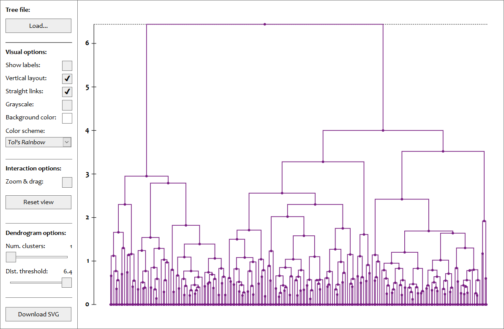
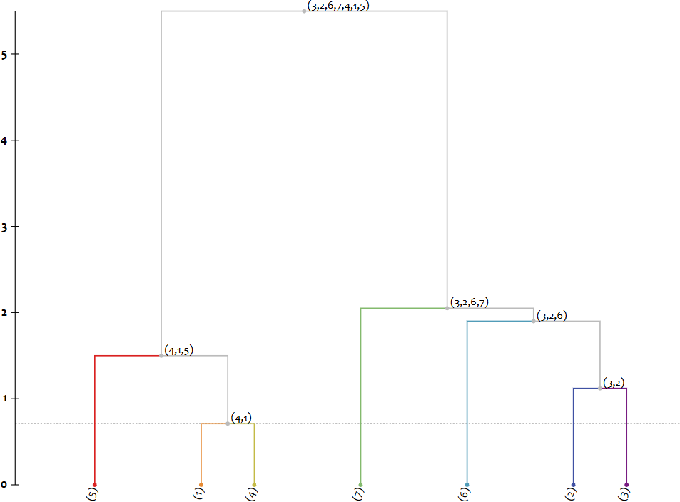
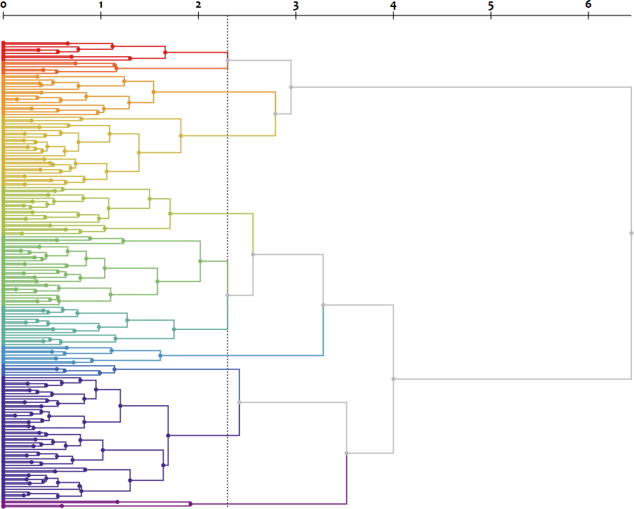
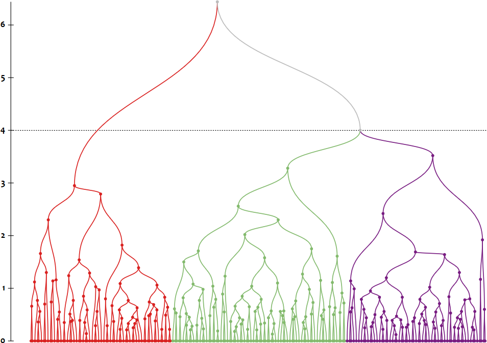
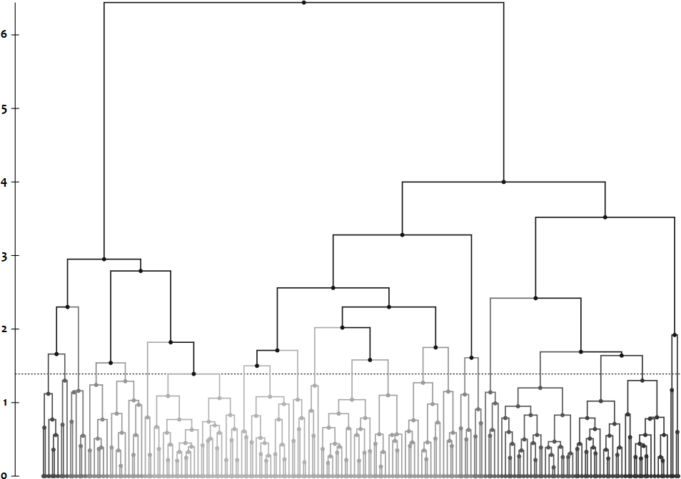
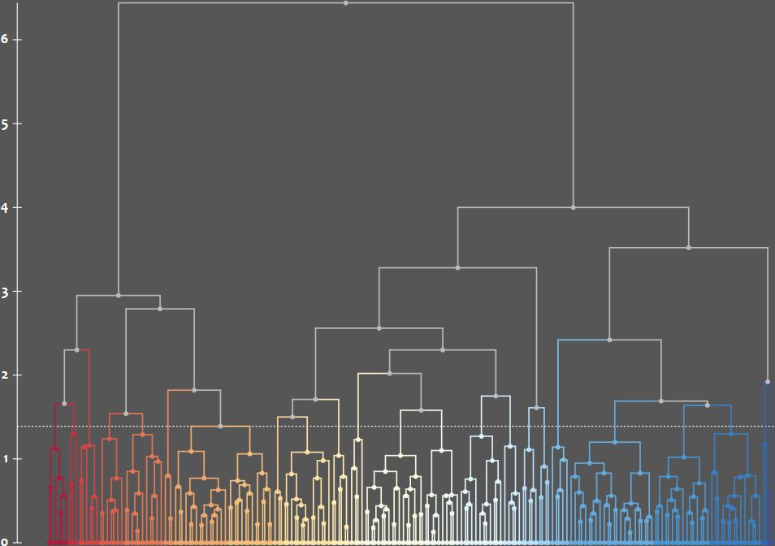

# Dendrogram Viewer
> A dendrogram viewer web-application

Dendrogram Viewer is an open-source interactive web-application written in javascript that allows the visualization of dendrograms, which are tree diagrams used to illustrate the arrangement of the clusters as produced by a hierarchical clustering (HC) algorithm. *D3.js* is used as the basis for dendrogram visualization. 

The application allows an interactive visualization of different number of clusters and different dissimilarities / distances. It also has several visual options, such as dendrogram color palette selection, vertical layout, viewing cluster labels, etc.

Dendrogram Viewer is open-source under the [MIT license](https://raw.github.com/pedrodbs/DendrogramViewer/master/LICENSE.md) and is free for commercial use.

- Source repository: https://github.com/pedrodbs/DendrogramViewer

**Table of contents**

- [Dependencies](#dependencies)
- [Usage](#usage)
- [See Also](#see-also)

------

## Dependencies

The D3.js dendrogram layout is based on the instructions in this article:

- [How to make a dendrogram using the D3 library](http://www.meccanismocomplesso.org/en/dendrogramma-d3-parte1/) 

In addition, the following javascript packages are used in the application:

- [D3.js](https://d3js.org/) (v3), used for the dendrogram layout visualization
- [jscolor Color Picker](http://jscolor.com/) (v2.0.5), used for background color selection
- [Colour Palette Generator](https://github.com/google/palette.js/tree/master), used for dendrogram color palette selection
- [SVG Crowbar](https://nytimes.github.io/svg-crowbar/) (v2, modified to not export styles and hence reduce file size), used for dendrogram export to SVG image files

## Usage

You can `git clone` the Dendrogram Viewer [source code](https://github.com/pedrodbs/DendrogramViewer) and then open the `index.html` file in a web browser ([Firefox](https://www.mozilla.org/firefox) usage is recommended for better results).

### Json dendrogram file definition

The json file format is a modified version of the standard format used for trees by D3.js to make large clustering files more compact. Each cluster is represented by a node object where:

- Attribute `n` holds the *name* or id of the cluster;
- Attribute `d` is the *dissimilarity* / distance at which it was found and created by the HC algorithm;
- Attribute `c` is a list containing the pair of *parents / children* from which the cluster was created.

For example, the following json was produced by using the [Aglomera.NET](https://github.com/pedrodbs/DendrogramViewer) framework to cluster the data-set in [Kaufman & Rousseeuw, 1990]:

```json
{
  "n": "(1;4;5;2;3;6;7)", "d": 5.5,
  "c": [
    { "n": "(2;3;6;7)", "d": 2.05,
      "c": [
        {
          "n": "(2;3;6)", "d": 1.9,
          "c": [
            {
              "n": "(2;3)", "d": 1.12,
              "c": [
                { "n": "(3)", "d": 0.0, "c": [] },
                { "n": "(2)", "d": 0.0, "c": [] } ] },
            { "n": "(6)", "d": 0.0, "c": [] } ] },
        { "n": "(7)", "d": 0.0, "c": [] } ]
    },
    { "n": "(1;4;5)", "d": 1.5,
      "c": [
        { "n": "(1;4)", "d": 0.71,
          "c": [
            { "n": "(4)", "d": 0.0, "c": [] },
            { "n": "(1)", "d": 0.0, "c": [] } ] },
        { "n": "(5)", "d": 0.0, "c": [] } ]
    } ]
}
```

### Loading files

The application automatically loads a default json file from the `examples` folder. Manual file selection can be achieved in two ways:

- By using the `file` parameter in the URL, *e.g.* `file:///index.html?file=examples/iris.json;`
- By clicking the `Load...` button and selecting the desired file.



### Interaction

- Supports *zooming* (mouse scroll) and *dragging* (mouse click and drag) of the dendrogram elements by toggling the `Zoom & drag: ` check-box.
- Changing the the `Num. clusters `  slider will allow the visualization of the *cluster-set* of the corresponding size. The instances within a particular cluster are visualized by having the same node and link color. Choosing a value of `1` will show a *single cluster* containing all instances, *i.e.*, all with the same color.
- Changing the the `Dist. threshold `  slider will allow the visualization of the *cluster-set* that the algorithm found at the corresponding *dissimilarity / distance*. Choosing a value of `0` will show each instance in its own cluster, *i.e.*, all with distinct colors.

### SVG Export

To export / download the dendrogram into an SVG ([Scalable Vector Graphics](https://en.wikipedia.org/wiki/Scalable_Vector_Graphics)) file, click the `Download SVG` button. <u>Note:</u> this will export an image file with basic element styling, *e.g.*, colors and weights. For full formatting place the `styles.css` in the same folder (and possibly customize the style file).

### Visual options

#### **Cluster Label Visualization**

Supports *viewing the labels* of each cluster (usually the instances contained therein) by toggling the `Show labels` check-box.



#### **Layout**

Supports both *vertical* and *horizontal* dendrogram layouts by toggling the `Vertical layout` check-box.



#### **Links Layout**

Supports both *straight* and *rounded* tree branch links by toggling the `Straight links` check-box.



#### Colors

Supports grayscale colors, by toggling the `Grayscale` check-box.



Allows a selection between different *color palettes* to be used for the dendrogram's cluster colors, by choosing from the `Color scheme` combo-box, including *Tol's*, *Color Brewer*, etc. <u>Note:</u> some palettes have a limit on the number of colors hence a limited number of clusters have to be selected.

*Background color* can also be chosen by using the `Background color ` picker.



## See Also

**References**

1. Kaufman, L., & Rousseeuw, P. J. (1990). *[Finding groups in data: an introduction to cluster analysis](https://books.google.com/books?hl=en&lr=&id=YeFQHiikNo0C&oi=fnd&pg=PR11&ots=5ApcG5OEwC&sig=Sx5Bhqfaymzg1U9aRQVIFxmqiHY)*. John Wiley & Sons.

**Other links**

- [Aglomera.NET](https://github.com/pedrodbs/DendrogramViewer)
- [Dendrogram (Wikipedia)](https://en.wikipedia.org/wiki/Dendrogram)
- [D3.js](https://d3js.org/)


Copyright &copy; 2018, [Pedro Sequeira](https://github.com/pedrodbs)